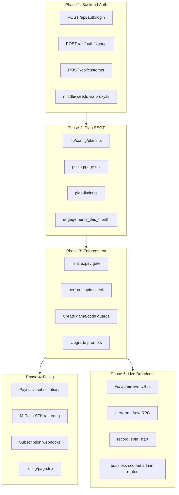

# Engage Platform — Post-Auth Roadmap

## Current State (from codebase audit)

The engagement core is largely built: spin/trivia/draw engines, `[businessSlug]` live pages with Supabase Realtime, code-gated activation, and business signup via [`src/app/api/business/create/route.ts`](src/app/api/business/create/route.ts). Critical gaps:

- **Auth is client-side** (`AuthContext.signInWithPassword`) with no session returned from server signup/redeem routes
- [`src/proxy.ts`](src/proxy.ts) exists but **no root middleware.ts** — admin routes unprotected at edge
- **Role model conflict**: business owners get `users.role = "customer"` but middleware checks `role === "admin"`
- [`src/lib/services/plan-limits.ts`](src/lib/services/plan-limits.ts) defines limits but **nothing calls them**
- **Paystack is a DB enum only**; checkout uses PayPal/M-Pesa one-offs with broken webhooks
- **Live pages exist** under `[businessSlug]` but admin links still point to deleted e-commerce paths; `perform_draw` RPC missing

---

## Phase 1: Backend Auth (your immediate priority)

Replicate the [`business/create`](src/app/api/business/create/route.ts) pattern for all auth endpoints.

### 1.1 Shared auth infrastructure

Create [`src/lib/schemas/auth-schema.ts`](src/lib/schemas/auth-schema.ts):

- `loginSchema` — email, password
- `customerSignupSchema` — fullName, email, password (extract from inline schema in [`src/app/api/customer/route.ts`](src/app/api/customer/route.ts))
- Reuse `businessSignupSchema` from [`src/lib/schemas/business-schema.ts`](src/lib/schemas/business-schema.ts)

Create [`src/lib/auth/server.ts`](src/lib/auth/server.ts):

- `createSessionForUser(email, password)` — uses [`createClient`](src/lib/supabase/server.ts) to call `signInWithPassword` and set httpOnly cookies
- `requireUser()` / `requireBusinessAdmin(businessSlug)` helpers for API routes
- Replace `auth.admin.listUsers()` email lookups with `auth.admin.getUserByEmail()` (or query users table)

### 1.2 New API routes

| Route | Purpose |
|-------|---------|
| `POST /api/auth/login` | Zod validate, rate limit (`secureRatelimit`), server session cookies, return redirect hint (admin vs customer) |
| `POST /api/auth/signup` | Refactor existing route; keep bot check + rate limit |
| `POST /api/auth/logout` | Clear session server-side |
| `POST /api/customer` | Fix route mismatch — code-entry calls `/api/customer/redeem-code` but handler is `/api/customer` |

**Critical fix**: After user creation in `business/create` and customer routes, call `createSessionForUser` so the client is logged in immediately (today both routes create users but leave the browser unauthenticated).

### 1.3 Frontend consolidation

- Build [`src/app/(public)/login/page.tsx`](src/app/(public)/login/page.tsx) (currently empty) — Engage-branded login form posting to `/api/auth/login`
- Update [`src/app/(public)/code-entry/page.tsx`](src/app/(public)/code-entry/page.tsx): fix API URL, use `customerSignupSchema` instead of `businessSignupSchema`, move code lookup to `GET /api/customer/validate-code?code=...` (server-side, no direct `access_codes` client query)
- Update [`src/app/(public)/business/signup/page.tsx`](src/app/(public)/business/signup/page.tsx): after success, rely on session cookie instead of manual redirect to unauthenticated admin
- Deprecate legacy Northwind login at [`src/app/login/page.tsx`](src/app/login/page.tsx) — redirect to `(public)/login`

### 1.4 Wire middleware

Create root [`src/middleware.ts`](src/middleware.ts) exporting proxy from [`src/proxy.ts`](src/proxy.ts) with these fixes:

- Admin check via `business_admins` join (use commented block at bottom of proxy.ts), not `users.role === "admin"`
- Add trial/subscription gate (Phase 3) — allow `/admin/[slug]/billing` when expired
- Protect `/account/*` for authenticated customers

### 1.5 Role model cleanup

- Business owners stay `users.role = "customer"` (platform-level)
- Authorization for admin = `business_admins` table only
- Update [`AuthContext`](src/lib/context/AuthContext.tsx): load `business_admins` memberships; fix `user_loyalty_profile` view reference (missing from migrations — add view or query users directly)

---

## Phase 2: Pricing Plans as Single Source of Truth

**Your choice**: unified engagements meter (spin + trivia answer + draw entry).

> I actually have Pricing Plan codes in the `src/lib/limits.ts`, you'll find `getPlanCode` function in the bottom where I have handcoded all the plans I made directly from Paystack dashboard. You may use existing Mpesa STK checkout as well as PayPal that were working for e-commerce (`src/app/(public)/checkout` and `src/app/api/checkout` as well as `src/app/api/webhooks`, these could be your building blocks) before deleting or modifying them.

### 2.1 Canonical plan config

Create [`src/lib/config/plans.ts`](src/lib/config/plans.ts) — single exported `PLANS` object consumed by:

- [`src/app/(public)/pricing/page.tsx`](src/app/(public)/pricing/page.tsx) — import instead of inline `PLANS` array
- [`src/lib/services/plan-limits.ts`](src/lib/services/plan-limits.ts) — import limits from config
- [`src/app/(admin)/admin/[businessSlug]/billing/page.tsx`](src/app/(admin)/admin/[businessSlug]/billing/page.tsx)
- Landing page [`src/app/page.tsx`](src/app/page.tsx)

Align limits with pricing page (add missing draw fields):

| Limit | Trial | Starter | Pro | Enterprise |
|-------|-------|---------|-----|------------|
| engagements/month | 100 | 500 | 5,000 | 25,000 |
| spin games | 1 | 1 | 3 | unlimited |
| trivia challenges | 1 | 1 | 3 | unlimited |
| active draws | 1 | 1 | 3 | unlimited |
| prize slots | 6 | 6 | 12 | 24 |
| trivia questions | 20 | 20 | 100 | unlimited |
| admin users | 1 | 1 | 3 | 10 |
| access codes | 3 | 10 | 50 | unlimited |

**Prices**: KES 3,999 / 9,999 / 24,999 (pricing page is canonical; billing page USD values must be updated or removed). USD currency is used to show the equivalent, make sure to note. Paystack will convert that amount from KES to USD or any other currency for international users.

### 2.2 Database: unified engagement counter

Migration in [`src/db/engagement_tool.sql`](src/db/engagement_tool.sql):

- Rename `spins_this_month` → `engagements_this_month` (or add column + backfill)
- Replace `increment_business_spin_count` with `increment_business_engagement(p_business_id, p_type)` where type is `spin` | `trivia` | `draw`
- Call from `perform_spin`, trivia answer RPC, and draw entry RPC
- Monthly reset cron/function already exists — update to reset engagements column

### 2.3 Enhance pricing page expression

Beyond importing shared config, reinforce plans visually:

- Add comparison row for draws and engagement cap prominently (not buried in feature list)
- Show "what happens at limit" inline per plan
- Pass selected `?plan=starter` through signup CTA → store on business row at creation (optional pre-selection)
- Add usage meter preview component (reusable in billing + admin dashboard)

---

## Phase 3: Plan Limit Enforcement (core resource management)

Wire [`plan-limits.ts`](src/lib/services/plan-limits.ts) into every resource-mutating path.

> Existing trivia creation in the admin comes from previous e-commerce version where admin could create multiple types of challenges, trivia type included. We have adopted trivia type support only in the db but we haven't on the admin UI/UX for this project. So, be careful while creating `canCreateTriviaChallenge` guard.

### 3.1 Server-side guards (fail closed)

| Action | Guard | Location |
|--------|-------|----------|
| Customer spin | `checkEngagementLimit` | `perform_spin` RPC or spin service before RPC |
| Trivia answer | `increment + limit check` | trivia answer RPC |
| Draw entry | `increment + limit check` | draw entry RPC |
| Create spin game | `canCreateSpinGame` | admin spin create API/page |
| Create trivia | `canCreateTriviaChallenge` (new) | admin trivia create |
| Create draw | `canCreateDraw` (new) | admin draw create |
| Create access code | `canCreateCode` | codes page / API |
| Add admin user | `canAddAdminUser` (new) | business settings |
| Prize slots | `maxPrizeSlots` | spin game config save |

### 3.2 Trial expiry

In middleware + a shared `getBusinessAccessStatus(business)`:

- `trial + trial_ends_at < now` → `subscription_status = expired`, block admin except billing/settings
- `past_due` / `expired` → read-only admin, block customer engagements
- Dashboard banner with days remaining + upgrade CTA

### 3.3 Upgrade UX

- When limit hit: toast/modal with current usage, plan cap, and link to `/admin/[slug]/billing?upgrade=pro`
- Billing page shows side-by-side plan comparison from shared config
- Soft warning at 80% and 95% engagement usage (admin notification)

---

## Phase 4: Paystack + M-Pesa Subscriptions

**Your choice**: Paystack for cards + separate M-Pesa STK for Kenyan businesses.

### 4.1 Paystack integration

- Add `paystack` npm package (or direct REST)
- Env vars: `PAYSTACK_SECRET_KEY`, `NEXT_PUBLIC_PAYSTACK_PUBLIC_KEY`
- Wire existing `getPlanCode()` in [`src/lib/limit.ts`](src/lib/limit.ts) — move to `plans.ts`, map to Paystack plan codes
- `POST /api/billing/paystack/initialize` — create/update Paystack customer, initialize subscription with plan code + billing cycle
- `POST /api/webhooks/paystack` — handle `subscription.create`, `charge.success`, `invoice.payment_failed`, `subscription.disable`
- On success: update `businesses.plan`, `subscription_status = active`, `next_billing_at`, `payment_method = paystack`
- Store `paystack_customer_code` and `paystack_subscription_code` on businesses (new columns; repurpose unused `stripe_*` columns or add explicit ones)

### 4.2 M-Pesa STK for subscriptions

- `POST /api/billing/mpesa/subscribe` — STK push for first month; store phone on business
- M-Pesa lacks native recurring — implement monthly renewal job (Vercel cron or Supabase pg_cron):
  - 3 days before `next_billing_at`: send STK push reminder
  - On payment: extend `next_billing_at` by 30 days
  - On failure after grace period: `subscription_status = past_due`
- Fix existing M-Pesa webhook mismatch (currently expects `orderId` for e-commerce orders)

### 4.3 Billing page overhaul

[`src/app/(admin)/admin/[businessSlug]/billing/page.tsx`](src/app/(admin)/admin/[businessSlug]/billing/page.tsx):

- Remove PayPal one-off checkout (or keep for annual only if needed)
- Plan picker using shared `PLANS` config with KES prices
- Payment method selector: Paystack (card) vs M-Pesa
- Usage meter: `engagements_this_month / plan.maxEngagements`
- Trial countdown + post-trial lock messaging
- Add `/admin/[businessSlug]/billing/success` and `/billing/cancel` pages (currently missing)

### 4.4 Schema updates

- Add `paystack` to `business_payments.payment_method` CHECK constraint
- `business_payments` records for each charge (audit trail)

---

## Phase 5: Live Broadcast — Make It Work End-to-End

Live displays are substantially built under `[businessSlug]`; main work is wiring and missing RPCs.

### 5.1 Fix all live URLs

Update links in:

- [`src/app/(admin)/admin/marketing/spin/page.tsx`](src/app/(admin)/admin/marketing/spin/page.tsx)
- [`src/app/(admin)/admin/marketing/challenges/page.tsx`](src/app/(admin)/admin/marketing/challenges/page.tsx)
- [`src/components/admin/draw-card.tsx`](src/components/admin/draw-card.tsx), `draw-list.tsx`
- [`src/app/(public)/[businessSlug]/spin/[gameId]/page.tsx`](src/app/(public)/[businessSlug]/spin/[gameId]/page.tsx)

**Pattern**: `/{businessSlug}/spin/live/{gameId}`, `/{businessSlug}/trivia/{challengeId}/live`, `/{businessSlug}/draw/{drawId}/live`

### 5.2 Missing database functions

Add to SQL migrations:

- `perform_draw(p_draw_id)` — weighted random winner, insert `draw_winners`, update `draws.status`, emit `draw_live_ticker`
- `get_live_engagement_stats` — admin dashboard
- `REPLICA IDENTITY FULL` on `spin_attempts`, `spin_games`, `spin_live_ticker` for reliable Realtime

### 5.3 Spin live animation

Call `record_spin_start` at spin begin (in `perform_spin` or client) so OBS display fires `action_type = spin_start` before win reveal.

### 5.4 Admin route consolidation

Either:
- **Option A (recommended)**: Move marketing admin pages to `/admin/[businessSlug]/spin`, `/trivia`, `/draws` scoped by business_id from slug
- **Option B**: Fix dashboard links to existing `marketing/*` paths but pass `businessSlug` context

Add "Open Live Display" + "Host Controls" buttons on business-scoped admin with correct URLs.

### 5.5 Draw flow unification

Pick server-side `perform_draw` RPC as canonical (matches spin/trivia server authority). Refactor draw control page from client-side winner pick + polling to Realtime + RPC.

### 5.6 Cleanup (lower priority)

- Remove or archive: `websocket-server.ts`, bundle/deals live services, deepseek live dashboards
- Delete unused `live-display-shell.tsx` OR wire it into the three live pages to reduce duplication

---

## Phase 6: E-Commerce Gutter Cleanup

Safe deletions after above phases:

- Legacy login/signup components (`SignUpForm`, Northwind branding)
- Order/checkout APIs if no longer needed (`src/app/api/orders/*`, PayPal order webhooks)
- `bundle-service.ts`, `deals-service.ts`, `useLiveBroadcast` e-commerce table listeners
- Fix README payment section (still says PayPal primary; update to Paystack + M-Pesa)

---

## Recommended Execution Order

| Sprint | Focus | Outcome |
|--------|-------|---------|
| Sprint 1 | Phase 1 (backend auth) | Secure login/signup, sessions work, middleware protects admin |
| Sprint 2 | Phase 2 + 3 (plans SSOT + enforcement) | Pricing page = truth; engagements metered; trial gates work |
| Sprint 3 | Phase 4 (billing) | Post-trial Paystack + M-Pesa subscriptions live |
| Sprint 4 | Phase 5 (live broadcast) | OBS displays work from business-scoped admin |
| Sprint 5 | Phase 6 (cleanup) | Remove e-commerce dead code |

---

## Key Files to Touch

| Area | Files |
|------|-------|
| Auth | `src/lib/schemas/auth-schema.ts`, `src/lib/auth/server.ts`, `src/app/api/auth/*`, `src/middleware.ts`, `src/proxy.ts` |
| Plans | `src/lib/config/plans.ts`, `src/lib/services/plan-limits.ts`, `src/app/(public)/pricing/page.tsx` |
| DB | `src/db/engagement_tool.sql`, `perform_spin`/trivia/draw RPCs |
| Billing | `src/app/api/billing/*`, `src/app/api/webhooks/paystack/route.ts`, `billing/page.tsx` |
| Live | `[businessSlug]/*/live/page.tsx`, admin marketing pages, `draws_advanced.sql` |